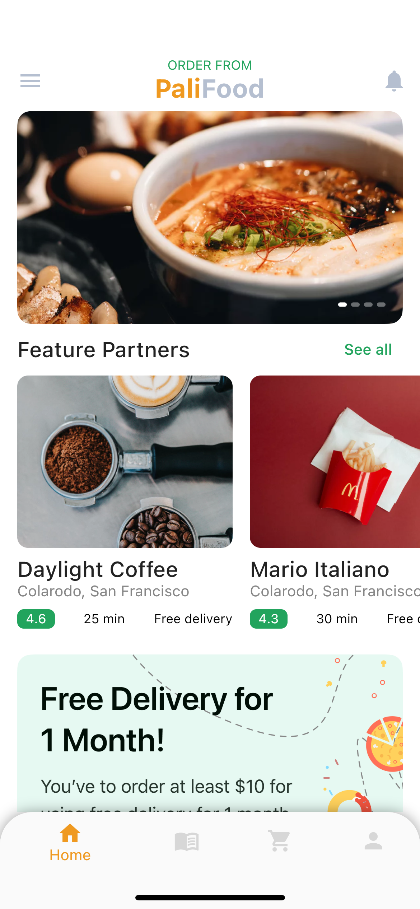

# Foods App

Aplikasi pemesanan makanan sederhana

## Library yang digunakan
- [Provider](https://pub.dev/packages/provider) - Modul untuk app state management
- [http](https://pub.dev/packages/http) - untuk fetch data dari API

## Screenshots
<!-- 

 -->

